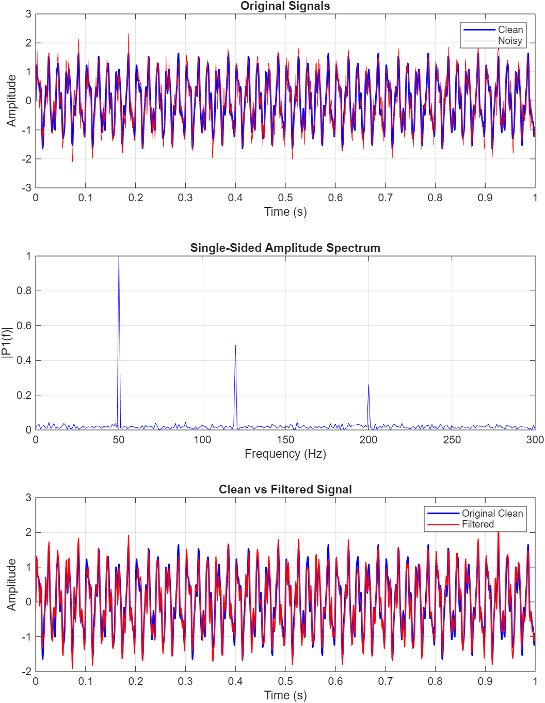
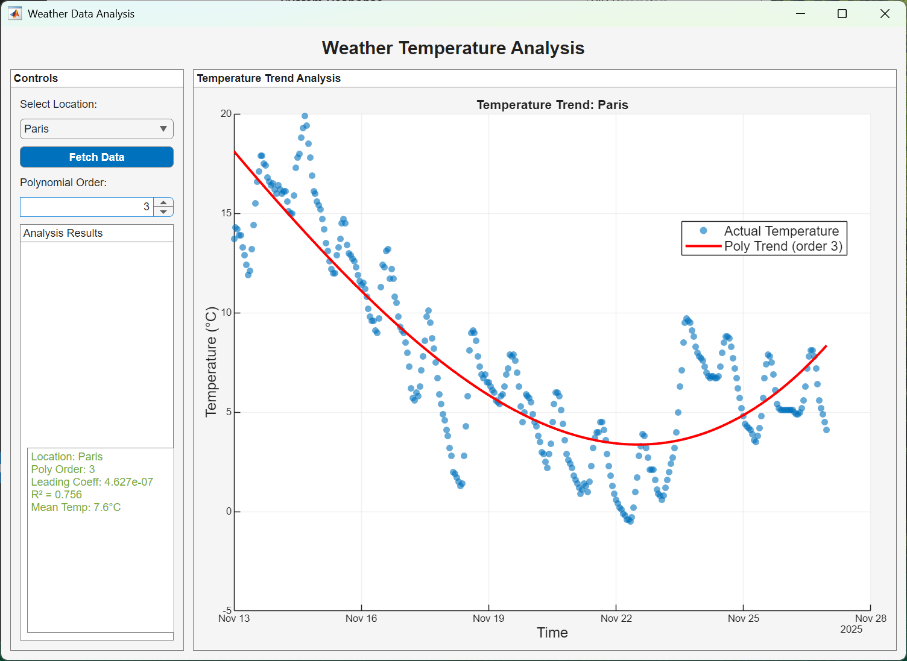
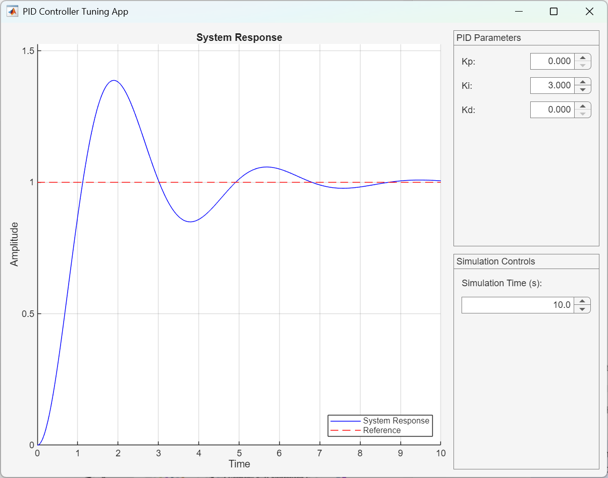

# MATLAB MCP Core Server Test repo

[](https://github.com/yanndebray/test-MCP/actions/workflows/matlab-tests.yml)

Add the content of the repo to path:
```matlab
addpath(genpath(pwd))
```

## Project Structure

### Data Visualization
Location: `data-viz/`

https://github.com/user-attachments/assets/4ad66711-d9e2-461a-96a3-0b864589ce52

Advanced visualization projects:
- `particle_animation.m` - MATLAB script for particle system animation
- `particle_system_animation.ipynb` - Jupyter notebook version with interactive elements

### Signal Processing
Location: `signal-proc/`



Signal analysis and processing demonstrations:
- `signal_analysis_demo.m` - Signal processing examples and visualizations

### Apps

Interactive MATLAB applications demonstrating various control systems and data analysis capabilities.

#### Weather Regression App
Location: `apps/weather/`

A regression analysis application for weather data prediction and visualization.



#### PID Tuning App
Location: `apps/pid/`

An interactive PID controller tuning application for control systems design and optimization.



### MATLAB Testing
Location: `matlab-testing/`

Comprehensive testing suite demonstrating MATLAB testing best practices:
- `MathOperations.m` - Example class with mathematical operations
- `MathOperationsTest.m` - Unit tests for the MathOperations class
- `propertyBasedTests.m` - Property-based testing examples
- `runAllTests.m` - Test runner script
- `coverage/` - Code coverage reports with HTML visualization

### Chats
Location: `chats/`

GitHub Copilot conversation replays using the Chat JSON Viewer. This tool enables you to replay and visualize GitHub Copilot conversations directly in your browser.

**View conversations online:** [https://yanndebray.github.io/test-MCP/chats/chat_view](https://yanndebray.github.io/test-MCP/chats/chat_view)

Available chat logs:
- `chat_weather_app.json` - Conversation about the weather regression app development

The chat viewer provides an interactive way to explore how GitHub Copilot assisted in building various components of this repository.